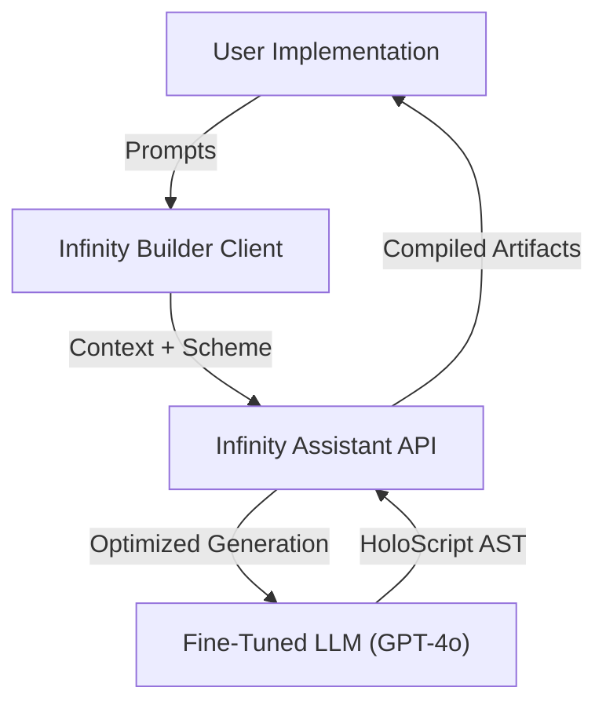

# AI Architecture: Infinity & Beyond

**Status**: 🟢 Production Ready  
**Core Components**: Infinity Assistant / Native AI Traits  
**Integration**: `@holoscript/infinityassistant`

---

## 1. The "Infinity" Protocol

HoloScript is the first language designed to be written by both Humans and AI. The **Infinity Protocol** standardizes how AI agents perceive, modify, and generate HoloScript code.

### Architecture



### Key Components

#### A. Infinity Builder (`@holoscript/infinityassistant`)

The official client for AI-driven development.

- **Natural Language to Code**: "Create a red bouncing ball" → `orb @prop { ... }`
- **Platform Optimization**: Auto-tunes assets for VR vs Mobile.
- **Self-Healing**: Automatically fixes syntax errors in generated code.

#### B. Native AI Traits (Experimental)

New directives that allow objects to expose themselves to AI perception.

- `@detectable`: Object broadcasts its semantic tags to AI agents.
- `@affordance`: Object declares how it _can_ be used (e.g., "sit", "grasp").

```holoscript
// Object that teaches AI how to use it
chair#wooden @detectable @affordance {
    tags: ["furniture", "seat"]
    actions: {
        "sit": { posture: "seated", offset: [0, 0.5, 0] }
    }
}
```

---

## 2. Experimental Bindings

### `@holoscript/llm` (Local Inference)

_Direct bindings to local LLMs (Llama 3, Mistral)._

```typescript
import { LLM } from '@holoscript/llm';

// Run inference inside the HoloScript runtime
const response = await LLM.infer('What is this object?', {
  context: object.toString(),
});
```

### `@holoscript/vrchat-export` (Transpiler)

_AI-assisted transpilation to Udon/Unity._

- Uses AST transformation to map HoloScript logic to Udon Graph interactables.

---

## 3. Roadmap

| Phase       | Feature                                       | Status   |
| ----------- | --------------------------------------------- | -------- |
| **Phase 1** | Text-to-HoloScript Generation                 | ✅ Live  |
| **Phase 2** | Context-Aware Modification ("Make it bigger") | ✅ Live  |
| **Phase 3** | Semantic Scene Understanding (`@detectable`)  | 🟡 Beta  |
| **Phase 4** | Autonomous Agents (Self-Coding)               | 🧪 Alpha |
